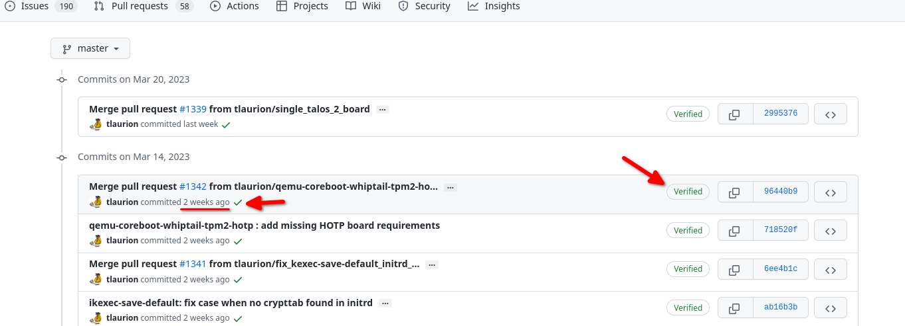
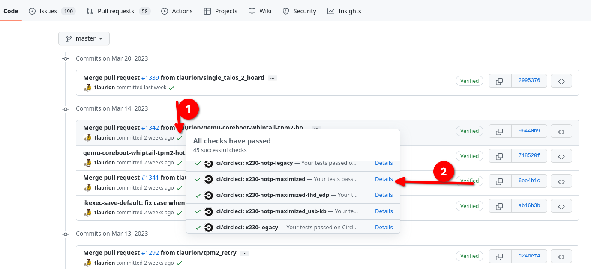
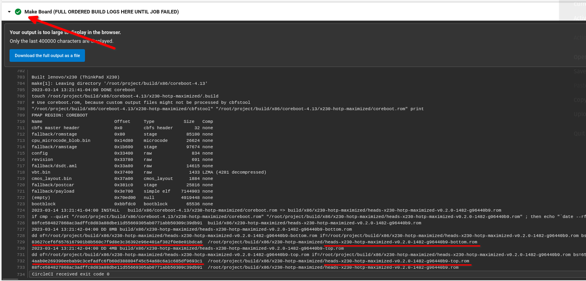
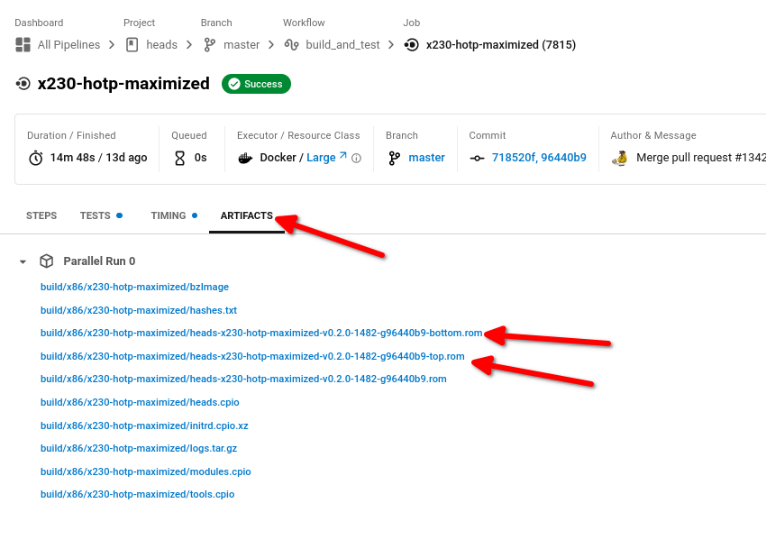

https://www.rototron.info/recover-bricked-bios-using-flashrom-on-a-raspberry-pi/

https://libreboot.org/docs/install/spi.html#reading

Download the top and bottom rom files from this commit https://app.circleci.com/pipelines/github/osresearch/heads/524/workflows/d13d6a02-1ffa-40ac-b721-e31ff69483d4/jobs/7458

grab the sha-sums from the Make Board check and compare them with what was downloaded


## Build

`git clone https://github.com/osresearch/heads`
`git switch -c 96440b928acb06de5b925ea12014c9c280b23165`


## Downloading the firmware

Original steps found here: https://osresearch.net/Downloading

They recommend not downloading from the latest commit, so let's head to the commits section of their github repo at https://github.com/osresearch/heads/commits/master - It's fairly safe to aim for a commit that was two weeks prior to today's date. Make sure the commit was "Verified" and that the Github Checkrun's passed(look for the green check mark, not the red X)


Find the commit you want to use, then click on the green checkmark, and on the little pop up window, scroll and find "x230-hotp-maximized". Click on "Details". This will pull you into circleCI

Go to "Make Board" section and click the drop down. Look for the sha265 sums for heads-x230-hotp-maximized-vX.X.X-X-X-bottom.rom and heads-x230-hotp-maximized-vX.X.X-X-X-top.rom. Notate the sums.


Example: 
Top - 4aab0e269390eebab9c3cefadfc6fb60d388804f45c54a68c6a1c685df9693c1
Bottom - 83627cef6f6576167901b8b560c7f9d8e3c36392e96e401af382f0e8e01bdca6



Now scroll back to the top of the CircleCI page and click on the "ARTIFACTS" tab. Download the top and bottom rom files. You can right click the download links and click "Save Link As..." if you're on Firefox.


Verify the check sums using the sha256sum command.

```bash
$ echo "4aab0e269390eebab9c3cefadfc6fb60d388804f45c54a68c6a1c685df9693c1 ~/Documents/git/heads-guide/heads-x230-hotp-maximized-v0.2.0-1482-g96440b9-top.rom" | sha256sum --check

~/Documents/git/heads-guide/heads-x230-hotp-maximized-v0.2.0-1482-g96440b9-top.rom: OK

$ echo "83627cef6f6576167901b8b560c7f9d8e3c36392e96e401af382f0e8e01bdca6 ~/Documents/git/heads-guide/heads-x230-hotp-maximized-v0.2.0-1482-g96440b9-bottom.rom" | sha256sum --check

~/Documents/git/heads-guide/heads-x230-hotp-maximized-v0.2.0-1482-g96440b9-bottom.rom: OK
```

You're now ready to start flashing them


## Flashing via Raspberry Pi

Connect to the top chip and run `sudo flashrom -p linux_spi:dev=/dev/spidev0.0,spispeed=2000` and see if it detects the chip. You may get a list of possible chips, pick the one from the chart found here: https://osresearch.net/x230-maximized-flashing/

We're going to want to read the top one and then verified what was read is correct via
`sudo flashrom -p linux_spi:dev=/dev/spidev0.0,spispeed=2000 -r top.bin -c MX25L3206E/MX25L3208E`
and then
`sudo flashrom -p linux_spi:dev=/dev/spidev0.0,spispeed=2000 -v top.bin -c MX25L3206E/MX25L3208E`

Now we're going to write the new rom to the top chip via `sudo flashrom -p linux_spi:dev=/dev/spidev0.0,spispeed=2000 -c MX25L3206E/MX25L3208E -w heads-x230-hotp-maximized-v0.2.0-1400-g3ac896b-top.rom`

Now lets move onto the bottom chip

We're going to want to read the bottom one and then verified what was read is correct via
`sudo flashrom -p linux_spi:dev=/dev/spidev0.0,spispeed=2000 -r top.bin -c MX25L6406E/MX25L6408E`
and then
`sudo flashrom -p linux_spi:dev=/dev/spidev0.0,spispeed=2000 -v top.bin -c MX25L6406E/MX25L6408E`
Now we're going to write the new rom to the bottom chip via
`sudo flashrom -p linux_spi:dev=/dev/spidev0.0,spispeed=2000 -c MX25L6406E/MX25L6408E -w heads-x230-hotp-maximized-v0.2.0-1400-g3ac896b-bottom.rom`


## Flashing via programmer

Connect clip to top chip and run `sudo flashrom -p ch341a_spi` to discover what type of chip it is. Note: If you run into issues flashing, try reconnecting the connector or reconnecting the USB programmer to the USB port of the PC.

You should get a result that looks something like the following:

```
Found Macronix flash chip "MX25L3205(A)" (4096 kB, SPI) on ch341a_spi.
Found Macronix flash chip "MX25L3205D/MX25L3208D" (4096 kB, SPI) on ch341a_spi.
Found Macronix flash chip "MX25L3206E/MX25L3208E" (4096 kB, SPI) on ch341a_spi.
Found Macronix flash chip "MX25L3273E" (4096 kB, SPI) on ch341a_spi.
```
Copy each chip name(found inside the quotes) and search for them on https://osresearch.net/x230-maximized-flashing/ - The one that matches a result on that page is what you want. The chip on my board was `MX25L3206E/MX25L3208E`.

Now run the following to make a backup of your existing rom(replace the chip name with the one that matches yours): `sudo flashrom -r ~/Documents/git/heads-guide/top.bin --programmer ch341a_spi -c "MX25L3206E/MX25L3208E" &&  sudo flashrom -v ~/Documents/git/heads-guide/top.bin --programmer ch341a_spi -c "MX25L3206E/MX25L3208E"`

If verified, let's flash the heads firmware onto the top chip via the following command(not writing automatically verifies the rom): `sudo flashrom --programmer ch341a_spi -c MX25L3206E/MX25L3208E -w heads-x230-hotp-maximized-v0.2.0-1400-g3ac896b-top.rom`
If you get a `Verifying flash... VERIFIED.` message, you're good to proceed.

Now let's follow a similar pattern for the bottom chip

Connect clip to bottom chip and run `sudo flashrom -p ch341a_spi` to discover what type of chip it is. This will most likely be different from the top chip, so compare what's on the website stated above.

Now run the following to make a backup of your existing rom(replace the chip name with the one that matches yours): `sudo flashrom -r ~/Documents/git/heads-guide/bottom.bin --programmer ch341a_spi -c "MX25L6406E/MX25L6408E" &&  sudo flashrom -v ~/Documents/git/heads-guide/bottom.bin --programmer ch341a_spi -c "MX25L6406E/MX25L6408E"`

If verified, let's flash the heads firmware onto the top chip via the following command(not writing automatically verifies the rom): `sudo flashrom --programmer ch341a_spi -c MX25L6406E/MX25L6408E -w heads-x230-hotp-maximized-v0.2.0-1400-g3ac896b-bottom.rom`
If you get a `Verifying flash... VERIFIED.` message, you're good to proceed.

Now remove the clip and power on the machine. If it doesn't boot the first time, try again.


https://forum.archive.openwrt.org/viewtopic.php?id=69483
truncate -s +12288K openwrt.bin


--

## Qubes install

download qubues iso
format a card to ext4(fat32 wont work due to 4gb file limit)

copy iso and iso.asc to usb stick manually

copy qubes master gpg key to seperate usb key

plug them all in.

upload quubes master gpg key to tpm

to boot usb into qubes installer

heads will verify the gpp key using the qubes master gpg key and 
the iso.asc signing key

install qubes usual. set up disk encryption


---

## setting up keys(already installed OS)

Will wipe nitrokey(even when setting to the same admin/user pins)

make sure pings are no more than 12 characts.... could cause 
issues with nitro key


after installing os, if you get errors or anything after heads boots, just pick an option that will get  you to the main menu

1. Plug in your NitroKey and separate FAT formatted USB stick that your GPG public key could be saved to.
2. On the first screen, it should say "ERROR: GPG keyring empty!" - Scroll down to the bottom and select "Exit to recovery shell"
3. On the recovery shell, let's set the clock to the "exact time down to the second" in UTC via `date -s 'yyyy-mm-dd hh:mm:ss' && hwclock -w`
4. Then reboot
5. When the system reboots, you'll be back on the same "ERROR: GPG keyring empty!" screen. Click on "OEM Factory Reset / Re-Ownership". Then hit "Continue"
6. You'll get prompted with some questions:
   1. Type "N" for No for the first 3 questions
   2. Type "Y" for Yes for the 4th question.
7. Type in a TPM Ownership Password
8. Type in a GPG Admin Pin(Will become the new admin pin for your NitroKey)
9. Type in a GPG User Pin(Will be the new user pin for your NitroKey)
10. You'll then be asked if you want to set customer user information for the NitroKey's GPG key. Type "Y" for yes and hit enter
   1.  Type in your desired name
   2.  Type in your desired email address
   3.  Type in your desired comment(recommended would be "Security Key")
11. You'll then be asked if want to export the public key to a USB drive. Type "Y" for yes and hit enter.
12. Then select the usb drive you want the public key to be saved to
13. Now Heads will set up your NitroKey to work with Heads. This can take 5 - 10 minutes. Be patient and don't touch anything until it's completed
This is mostly important if you want TOTP to be reliable.
1.  You may get an error stating "Unable to create TPM counter". Just hit OK.
2.  You will probably then be brought to a page titled "ERROR: TOTP Generation Failed". Unplug your Nitrokey and reinsert it. 
3.  Now click "Generate new HOTP/TOTP secret"
4.  You may get a warning that any old secrets will be erased. Click OK and hit enter.
5.  You'll then be presented with a QR code. Scan it with your phone and hit enter
6.  Type your admin gpg key passcode and hit enter
7.  Now you'll be back to the Heads Home Menu. Go to Options, then "Update checksums and sign all files in /boot", click on it. The next screen click Yes. On the next screen, type "Y" to confirm your have your GPG Card(aka NitroKey) inserted.
8.  Then type in your TPM Owner password.
9.  If asked, enter your GPG User Pin and hit enter
10. If the signing fails, wait until you're back to the home screen, then pull out and reinsert your NitroKey and redo the steps for "Update checksums and sign all files in /boot".
13. You should be back on the Heads home menu. Click "Default Boot"
14. IF you get a "No Default Boot Option Configured" page, click yes.
15. Now choose the OS you want to boot. If asked, to Confirm boot details, select "Make Default" and hit enter
16. If asked if you would like to add a disk encryption to the TPM, select "N" for No. I haven't had luck figuring out this feature.
17. When asked if your GPG card is inserted, type "Y" for yes and hit enter
18. Type in your GPG user pin and hit enter
19. Your system should now boot into the OS you chose.

Make sure the reboot the system one more time to ensure the Nitrokey works fine. If you get an error with the system Unable to unseal the TOTP or TOTP Generation Failed, rerun the "Generate new TOTP/HOTP secret"

When the system boots up, the nitrokey should blink green and the HOTP status should be "Success" on the Heads Boot Menu. If you don't have your NitroKey with you, you can verify boot integrity with your smart phone to compare the TOTP code. This relies on the time being accurate.


## setting up keys(without OS installed)

Will wipe nitrokey(even when setting to the same admin/user pins)

make sure pings are no more than 12 characts.... could cause 
issues with nitro key


after installing os, if you get errors or anything after heads boots, just pick an option that will get  you to the main menu

drive with iso, should include iso, iso signing key, and qubes master signing key

1. Plug in your NitroKey, drive with iso and separate FAT formatted USB stick that your GPG public key could be saved to.
2. On the first screen, it should say "ERROR: GPG keyring empty!" - Scroll down to the bottom and select "Exit to recovery shell"
3. On the recovery shell, let's set the clock to the "exact time down to the second" in UTC via `date -s 'yyyy-mm-dd hh:mm:ss' && hwclock -w`
4. Then reboot
5. When the system reboots, you'll be back on the same "ERROR: GPG keyring empty!" screen. Click on "Add a GPG key to the running BIOS"
6. Then click "Add a GPG key to the running BIOS and reflash"
7. On the next screen where it states that a public key is required, click "Yes"
8. Go to your drive that includes the iso and two keys. Then select the Qubes Master Key. You'll then be asked if you want to proceed with flashing your BIOS with the updated version, click "yes"
9. You'll then be asked if you want to update checksums and sign all files in the /boot directory. Select "No" and hit enter.
10. You'll then be taken to a page with the title "ERROR: TOTP Generation Failed!". Select "Ignore error and continue to main menu"
11. Go to "Options" and then "Boot Options" and then "USB Boot"
12. Click on your USB disk with the ISO, then select the ISO
13. Using the GPG keys, Heads will verify the ISO. Then select the boot option for "Install Qubes OS"...
14. Install Qubes like normal and reboot when prompted
15. When the system reboots, you'll be back on the same "ERROR: TOTP Generation Failed" screen. Click on "Ignore error and continue to main menu". Then go to "Options -->" and then "OEM Factory Reset / Re-Ownership -->" and then click "Continue"
16. If you get a "Measured Integrity Report" page, click Ok.
17. You'll get prompted with some questions:
   1. Type "N" for No for the first 3 questions
   2. Type "Y" for Yes for the 4th question.
18. Type in a TPM Ownership Password
19. Type in a GPG Admin Pin(Will become the new admin pin for your NitroKey)
20. Type in a GPG User Pin(Will be the new user pin for your NitroKey)
21. You'll then be asked if you want to set customer user information for the NitroKey's GPG key. Type "Y" for yes and hit enter
   1.  Type in your desired name
   2.  Type in your desired email address
   3.  Type in your desired comment(recommended would be "Security Key")
22. You'll then be asked if want to export the public key to a USB drive. Type "Y" for yes and hit enter.
23. Then select the usb drive you want the public key to be saved to
24. Now Heads will set up your NitroKey to work with Heads. This can take 5 - 10 minutes. Be patient and don't touch anything until it's completed
This is mostly important if you want TOTP to be reliable.
1.  You may get an error stating "Unable to create TPM counter". Just hit OK.
2.  You "may" then be brought to a page titled "ERROR: TOTP Generation Failed". Regardless, unplug your Nitrokey and reinsert it. If you're on the Heads Boot Menu, got to "Options -->", then go to "TPM/TOTP/HOTP Options -->"
3.  Now click "Generate new HOTP/TOTP secret"
4.  You may get a warning that any old secrets will be erased. Click OK and hit enter.
5.  You'll then be presented with a QR code. Scan it with your phone and hit enter
6.  Type your admin gpg key passcode and hit enter
7.  Now you'll be back to the Heads Home Menu. Go to Options, then "Update checksums and sign all files in /boot", click on it. The next screen click Yes. On the next screen, type "Y" to confirm your have your GPG Card(aka NitroKey) inserted.
8.  Then type in your TPM Owner password.
9.  If asked, enter your GPG User Pin and hit enter
10. If the signing fails, wait until you're back to the home screen, then pull out and reinsert your NitroKey and redo the steps for "Update checksums and sign all files in /boot".
11. You should be back on the Heads home menu. Click "Default Boot"
12. IF you get a "No Default Boot Option Configured" page, click yes.
13. Now choose the OS you want to boot. If asked, to Confirm boot details, select "Make Default" and hit enter
14. If asked if you would like to add a disk encryption to the TPM, select "N" for No. I haven't had luck figuring out this feature.
15. When asked if your GPG card is inserted, type "Y" for yes and hit enter
16. Type in your GPG user pin and hit enter
17. Your system should now boot into the OS you chose.

Make sure the reboot the system one more time to ensure the Nitrokey works fine. If you get an error with the system Unable to unseal the TOTP or TOTP Generation Failed, rerun the "Generate new TOTP/HOTP secret"

When the system boots up, the nitrokey should blink green and the HOTP status should be "Success" on the Heads Boot Menu. If you don't have your NitroKey with you, you can verify boot integrity with your smart phone to compare the TOTP code. This relies on the time being accurate.


---

Notes:

Set up GPG key on Nitrokey https://docs.nitrokey.com/storage/linux/gpa


 copy public gpg key to seperate fat32 formatted usb stick 
Example filename: s1nack-nitrokey-032423.asc
--

